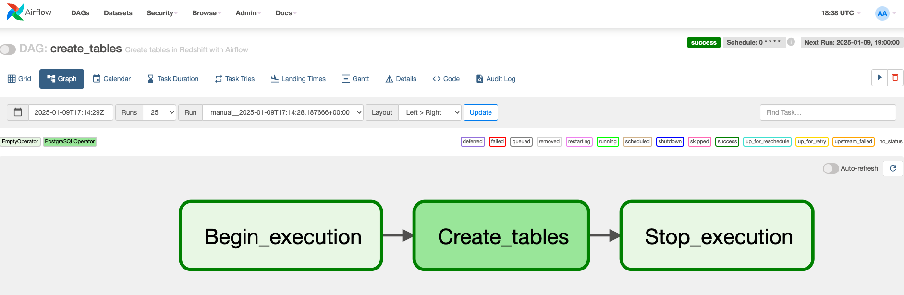
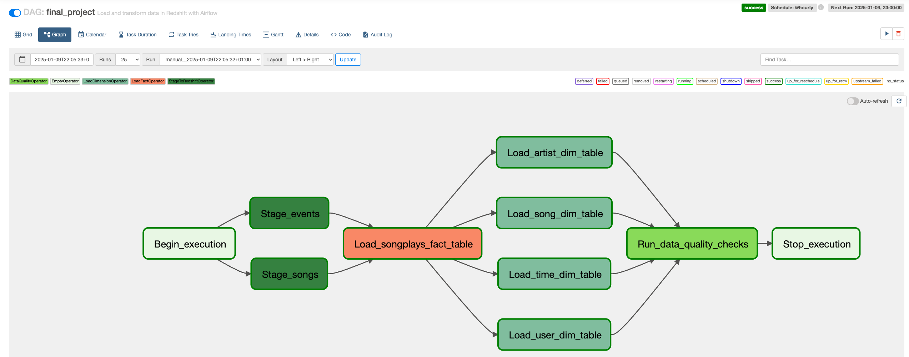

# Sparkify ETL Project with Apache Airflow

## 📘 **Introduction**
Sparkify, a music streaming company, aims to automate and monitor its ETL pipelines using **Apache Airflow** to ensure reliable data workflows and easy backfills with data quality checks.

## 📂 **Datasets**
- **Log data**: User activity logs
  - Path: `s3://udacity-dend/log_data`
- **Song data**: Song metadata
  - Path: `s3://udacity-dend/song_data`

## 🎯 **Project Goals**
1. Stage data from **S3** to **Redshift**
2. Load fact and dimension tables
3. Perform data quality checks

## 🛠️ **Tools Used**
- **Python** & **SQL**
- **Apache Airflow**
- **AWS (IAM, S3, Redshift Serverless)**

## 📋 **Airflow Data Pipeline**
The data pipeline in this project stages data from S3 to Redshift, loads it into fact and dimension tables, and performs data quality checks.

## 📦 **Copy S3 Data**
Create a project S3 bucket using **AWS Cloudshell**:
```bash
aws s3 mb s3://dend-francisjo/
```
Copy the data from the Udacity bucket to your S3 bucket:
```bash
aws s3 cp s3://udacity-dend/log-data/ s3://dend-francisjo/log-data/ --recursive
aws s3 cp s3://udacity-dend/song-data/ s3://dend-francisjo/song-data/ --recursive
aws s3 cp s3://udacity-dend/log_json_path.json s3://dend-francisjo/log_json_path.json --recursive
```


## ⚙️ **AWS Configuration**
### **Create an IAM User**:
   - Create a user named **awsuser** in AWS.
   - Attach the following policies to the user:
     - **AdministratorAccess**
     - **AmazonRedshiftFullAccess**
     - **AmazonS3FullAccess**

### **Configure AWS Redshift Serverless**:
   - Create a Redshift role named **my-redshift-service-role** using **AWS Cloudshell**:
     ```bash
     aws iam attach-role-policy --policy-arn arn:aws:iam::aws:policy/AmazonS3FullAccess --role-name my-redshift-service-role
     ```
   - Grant the role **S3 Full Access**.
   - Set up **AWS Redshift Serverless** and copy the **Redshift Workgroup endpoint**. This endpoint will be used later when configuring the **Redshift connection** in Airflow.

## ⚙️ **Airflow Configurations**
### **Create Airflow Variables**

Set the following variables in Airflow to configure your S3 paths:

```bash
airflow variables set s3_bucket dend-francisjo
airflow variables set s3_prefix_log_data log-data
airflow variables set s3_prefix_song_data song-data
airflow variables set s3_prefix_log_json_path log_json_path.json
```

### 🔐 **AWS Credentials & Redshift Connection**

Configure **AWS credentials** and **Redshift connection** in Airflow:
- **AWS**: Set up access via **Admin > Connections** in Airflow, using your IAM credentials.
- **Redshift**: Create a connection with:
  - **Connection ID**: `redshift`
  - **Type**: `Amazon Redshift`
  - **Host**: Redshift cluster endpoint
  - **Login/Password**:  Redshift credentials
  - **Port**: `5439`

## 🗄️ **Airflow DAGs**

### 1- **create_tables DAG Overview**
 <br/>


#### Operators
- **Begin_execution & Stop_execution**: Dummy operators representing the start and end points of the DAG.
- **Create_tables**: Creates tables in Redshift.

### 2- **final_project DAG Overview**

 <br/>

#### Operators
- **Begin_execution & Stop_execution**: Dummy operators representing the start and end points of the DAG.
- **Stage_events & Stage_songs**: Extracts and loads data from S3 to Amazon Redshift.
- **Load_songplays_fact_table & Load_*_dim_table**: Loads and transforms data from staging to fact and dimension tables.
- **Run_data_quality_checks**: Runs data quality checks to ensure no empty tables.

### 3- **Execution Steps**
1. Run the **create_tables** DAG to create tables in Redshift.
2. Run the **final_project** DAG to trigger the ETL data pipeline.